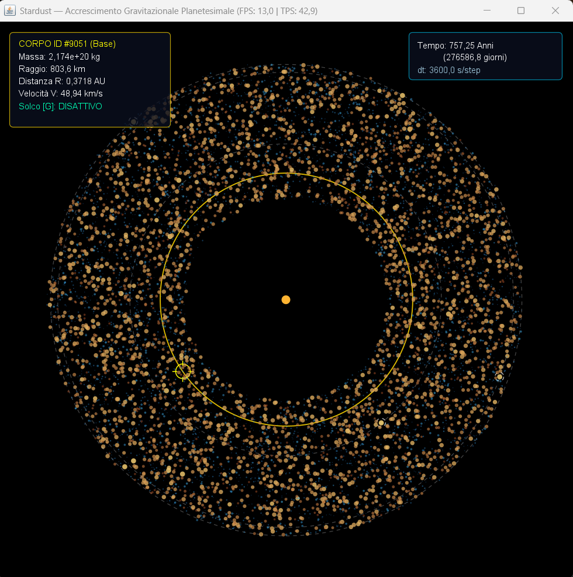

# Stardust
Un motore di simulazione a N-corpi che modella l'accrescimento gravitazionale durante la formazione dei pianeti.



## Dalla polvere ai pianeti
Simulare la formazione planetaria, dal singolo grano di polvere microscopico fino a un pianeta completo, non è (solo) una questione di potenza di calcolo. È un problema in cui, lungo il percorso, cambiano radicalmente sia la scala fisica in gioco sia le forze che dominano il sistema. La ricerca scientifica affronta il problema per fasi, ciascuna con i propri modelli e le proprie ipotesi semplificative.

Il percorso, dai micrometri ai migliaia di chilometri, attraversa circa tredici ordini di grandezza, la stessa distanza relativa che separa un granello di sabbia dalla Terra intera. Nessun approccio numerico riesce a coprire un intervallo così ampio, perché il numero di corpi da tracciare individualmente va  oltre ogni possibilità di calcolo, e perché le forze che contano a un estremo (elettrostatiche, di van der Waals) diventano trascurabili all'altro, sostituite dalla gravità.

Le quattro fasi in cui la ricerca suddivide il problema sono:

### 1. Coagulazione della polvere (da micrometri a centimetri/decimetri)
I grani di polvere primordiale si scontrano nel disco protoplanetario e si attaccano tra loro grazie a forze di superficie, elettrostatiche e di van der Waals, non alla gravità, che a queste masse è del tutto irrilevante. Poiché i corpi coinvolti sono in numero enorme (dell'ordine di 10¹⁸–10²⁰ per formare anche un solo oggetto di un chilometro), si ricorre a modelli statistici di distribuzione di massa.

### 2. La "barriera dei metri"
Attorno alla scala del centimetro-metro la crescita si interrompe. I corpi più grandi tendono a rimbalzare o a frammentarsi anziché fondersi, mentre il gas del disco protoplanetario esercita un attrito (aerodynamic drag) che fa perdere momento angolare, facendo precipitare i frammenti verso la stella prima che possano ingrandirsi.  
È tuttora uno dei problemi aperti: la teoria classica prevede che in questa fascia dimensionale i corpi dovrebbero cadere nella stella più velocemente di quanto riescano ad accrescersi.

### 3. Streaming instability: il salto oltre la barriera
Il superamento della barriera dei metri non avviene per accrescimento graduale, ma tramite un'instabilità aerodinamico-gravitazionale. Piccole disomogeneità locali generano un feedback con il gas che raccoglie i ciottoli (pebble) in filamenti densi, i quali collassano direttamente in planetesimi per autogravità. Questo si studia tipicamente con codici idrodinamici in shearing box.

### 4. Accrescimento gravitazionale (da planetesimi a pianeti)
I corpi hanno masse sufficienti perché la mutua gravità domini su ogni altra interazione, e il loro numero scende a livelli computazionalmente trattabili (migliaia-milioni). Le forze elettrostatiche sono fisicamente ininfluenti mentre l'attrito del gas resta rilevante per i planetesimi più piccoli, smorzandone eccentricità e inclinazioni, e favorendo così la crescita, per poi diventare via via trascurabile man mano che i corpi crescono.


## Modelli e Fenomeni Fisici

### 1. Interazione Gravitazionale
* **Il fenomeno:** La gravità è la forza dominante della Fase 4. Regola sia l'attrazione reciproca tra i planetesimi sia il moto orbitale attorno al corpo centrale, determinando la struttura globale del disco.
* **Come funziona:** Ogni particella esercita una forza attrattiva proporzionale al prodotto delle masse e inversamente proporzionale al quadrato della distanza (legge di gravitazione universale di Newton).
* **Come lo modello:** Per gestire sistemi con migliaia di corpi senza collassare a livello computazionale ($\mathcal{O}(N^2)$), il motore adotta un approccio gerarchico basato sull'algoritmo **Barnes-Hut** ($\mathcal{O}(N \log N)$), che approssima l'attrazione dei cluster distanti tramite alberi di suddivisione spaziale (QuadTree/OctTree).

### 2. Attrito del Gas (Aerodynamic Drag)
* **Il fenomeno:** Nel disco protoplanetario è presente un residuo di gas gassoso che orbita a una velocità leggermente inferiore rispetto ai corpi solidi (a causa del gradiente di pressione radiale). Questo crea un vento contrario che frena i planetesimi, facendone decadere l'energia orbitale.
* **Come funziona:** Il gas esercita una resistenza aerodinamica dipendente dalla densità del mezzo, dalla velocità relativa tra particella e gas, e dalle dimensioni fisiche del corpo.
* **Come lo modello:** È implementato con una transizione continua tra i regimi di **Epstein** (quando il diametro del corpo è inferiore al cammino libero medio delle molecole di gas) e **Stokes** (per corpi più grandi), smorzando l'eccentricità e l'inclinazione orbitale dei frammenti minori.

### 3. Dinamica degli Urti, Accrescimento e Frammentazione
* **Il fenomeno:** Quando due corpi si intersecano nello spazio, l'esito dello scontro dipende dall'energia cinetica relativa e dalle proprietà meccaniche dei materiali: possono rimbalzare elasticamente/anelasticamente, fondersi (accrescimento) o frantumarsi in uno sciame di detriti.
* **Come funziona:** L'energia d'urto nel sistema di riferimento del centro di massa viene confrontata con soglie di energia critica di legame gravitazionale e strutturale delle particelle coinvolte.
* **Come lo modello:** 
  * **Accrescimento / Cannibalismo:** Se la velocità relativa è inferiore alla velocità di fuga combinata, i corpi si fondono conservando la massa totale e ricalcolando il raggio equivalente (assumendo densità costante).
  * **Rimbalzo:** Se l'urto è anelastico ma sotto la soglia di rottura, viene applicato un coefficiente di restituzione per calcolare le velocità post-impatto.
  * **Frammentazione:** Se l'energia cinetica supera la soglia critica, il corpo maggiore viene disgregato in un numero controllato di frammenti minori, distribuendo la massa residua e preservando la quantità di moto totale.

### 4. Forze Elettrostatiche (Interazione Coulombiana)
* **Il fenomeno:** Dominanti nella Fase 1 sui grani microscopici di polvere, dove la carica elettrica accumulata (per fotoionizzazione o collisioni) genera attrazione o repulsione elettrostatica a corto raggio.
* **Come funziona:** Regolate dalla legge di Coulomb, diventano del tutto trascurabili su scala macroscopica a causa della neutralità elettrica complessiva dei corpi massicci.
* **Come lo modello:** Come per l'interazione gravitazionale, per gestire migliaia di corpi senza collassare a livello computazionale, il motore adotta un approccio gerarchico basato sull'algoritmo **Barnes-Hut**. Anzi, per ottimizzazione le due forze sono calcolate nello stesso ciclo di gestione dell'algoritmo.


## Architettura e Ottimizzazioni Numeriche
Per garantire prestazioni elevate (mantenendo un alto numero di corpi attivi a frequenze di aggiornamento stabili), il motore adotta diverse soluzioni ingegneristiche:

* **Griglia Spaziale di Collisione (`CollisionGrid`):** La ricerca dei contatti non avviene per forza bruta, ma sfrutta una suddivisione spaziale a celle che riduce la complessità della rilevazione degli urti limitando la ricerca ai vicini prossimi.
* **Concorrenza e Thread Safety:** Il calcolo delle forze e la risoluzione delle collisioni sono parallelizzati tramite Stream Java multi-core. Nelle sezioni critiche di interazione tra particelle, l'accesso concorrente è regolato da un ordinamento rigoroso basato sugli ID dei corpi per prevenire condizioni di deadlock.
* **Gestione dei Savepoint:** Il motore traccia in tempo reale lo stato delle particelle e metriche globali (fusioni, rimbalzi, frammentazioni, cadute sulla stella), e permette la serializzazione e il ripristino dello stato della simulazione da punti di salvataggio discreti.
* **Interfaccia Grafica e Controlli Interattivi (`SimulationPanel`)**: L'interfaccia si disaccoppia dal ciclo di calcolo fisico tramite snapshot di stato sincronizzati, garantendo fluidità e prestazioni elevate senza pesare sui loop di calcolo. Dal pannello grafico è possibile gestire e visualizzare:
    - **Navigazione e Vista**: Zoom fluido con rotellina, panning con tasto destro e reset della vista tramite doppio click.
    - **Selezione e Camera Lock**: Interazione a click sui corpi celesti con pannello HUD dedicato, inclusa la possibilità di bloccare la telecamera sui corpi d'interesse e attivarne il tracciamento orbitale kepleriano.
    - **Analisi Dinamica del Disco**: Visualizzazione in tempo reale delle orbite dei corpi più massivi, dei solchi radiali a bassa densità e delle fasce di clearing planetario mirate (tasto rapido 'G').
    - **Comandi di Sessione**: Gestione della pausa in tempo reale sincronizzata con il motore ('P') e funzionalità integrata di esportazione istantanea di screenshot in formato PNG (saveScreenshot).


## Definizioni
#### Sfera di Hill
In astrofisica e meccanica celeste, la Sfera di Hill definisce la regione di spazio in cui la gravità di un corpo celeste domina rispetto a quella della stella centrale, determinando il raggio d'azione entro cui il corpo riesce a catturare e mantenere in orbita i propri satelliti o planetesimi.

#### Solco / Gap Protoplanetario
Regione anulare a bassa densità di materiale che si forma nel disco protoplanetario lungo l'orbita di un corpo massiccio (protopianeta), scavata per effetto combinato di risonanze gravitazionali, effetti mareali e interazioni dinamiche con i planetesimi vicini.

#### Regimi di Epstein e Stokes (Attrito del Gas)
Sono i due regimi fisici che descrivono la resistenza aerodinamica esercitata dal gas sul moto dei corpi solidi a seconda delle loro dimensioni rispetto al gas circostante:
- **Regime di Epstein**: Si applica quando il diametro del corpo è inferiore o comparabile al cammino libero medio delle molecole di gas. In questo caso le molecole colpiscono il corpo individualmente.
- **Regime di Stokes**: Si applica quando il corpo è sufficientemente grande rispetto al cammino libero medio delle molecole, permettendo di trattare il gas come un fluido continuo caratterizzato da una propria viscosità.

#### Energia di Legame Gravitazionale e Strutturale
- **Energia di legame strutturale**: La soglia di energia meccanica legata alla coesione interna del materiale solido (roccia, ghiaccio o polvere), fondamentale per resistere agli urti nei corpi di piccola scala dove la gravità è trascurabile.
- **Energia di legame gravitazionale**: L'energia totale necessaria affinché tutti i frammenti di un corpo disgregato superino la mutua attrazione e si allontanino definitivamente nello spazio senza ricadere insieme per effetto della gravità.

#### Softening di Plummer
Parametro geometrico ($\epsilon$) introdotto nel calcolo del potenziale gravitazionale di N-corpi per evitare singolarità numeriche e forze infinite in caso di collisioni o passaggi ravvicinati tra particelle, smussando l'andamento del campo a cortissima distanza.

#### QuadTree e OctTree
Strutture dati geometriche gerarchiche utilizzate negli algoritmi di N-corpi (come Barnes-Hut) per suddiscere lo spazio ricorsivamente in regioni circoscritte:
- **QuadTree**: Struttura bidimensionale in cui ogni nodo dello spazio viene suddiviso in 4 quadranti (quadtree), impiegata per indicizzare e approssimare la distribuzione delle particelle in piani cartesiani.
- **OctTree**: Estensione tridimensionale in cui lo spazio viene suddiviso in 8 ottanti, utilizzata per simulazioni volumetriche complete (sebbene il piano di lavoro principale di Stardust si sviluppi su coordinate planari, l'albero gerarchico modella la suddivisione spaziale dei nodi).

#### Algoritmo Euler-Cromer (Eulero Semi-Implicito)
Algoritmo di integrazione numerica del primo ordine per equazioni differenziali ordinarie (ODE), impiegato nella simulazione per aggiornare posizioni e velocità. A differenza del metodo di Eulero esplicito, calcola prima la velocità aggiornata e utilizza immediatamente quest'ultima per calcolare la nuova posizione.

---


## Collocazione e perimetro di Stardust
Questo motore di simulazione si colloca nella Fase 4. L'architettura non risolve la microfisica di superficie né la fluidodinamica del gas, ma ne include l'effetto dinamico tramite una forza di drag con transizione tra i regimi di Epstein e Stokes. La frammentazione è modellata in forma semplificata, con conservazione della quantità di moto tra i frammenti generati. Il cuore del motore resta l'interazione gravitazionale reciproca, ottimizzata tramite algoritmi gerarchici come Barnes-Hut per scalare in modo efficiente sul numero di corpi.

>Il motore include anche un modello di interazione coulombiana (disattivato di default, poiché ininfluente alle masse tipiche della Fase 4), predisposto come base per un'eventuale estensione futura verso le fasi di coagulazione della polvere.

## Parametri di Simulazione (`SimulationConfig`)
Tutti i parametri fisici e numerici della simulazione sono centralizzati come costanti statiche in `SimulationConfig.java`, e vanno modificati (e ricompilati) direttamente lì per sperimentare con scenari diversi. I principali:

* **Corpi e tempo**: `N` (numero di particelle iniziali, default 15000), `DT` (passo di integrazione in secondi, default 3600s = 1 ora).
* **Disco protoplanetario**: `DISK_INNER_RADIUS` / `DISK_OUTER_RADIUS` (estensione dell'anello iniziale, in AU), `INITIAL_VELOCITY_DISPERSION` (eccita eccentricità/inclinazioni iniziali).
* **Materia**: `BASE_PARTICLE_MASS_MIN` / `BASE_PARTICLE_MASS_MAX` e `MASS_POWER_LAW_INDEX` (distribuzione a legge di potenza delle masse iniziali), `INITIAL_DUST_DENSITY`.
* **Collisioni**: `GRAVITATIONAL_CAPTURE_MULTIPLIER` (soglia di fusione rispetto alla velocità di fuga reciproca) e `FRAGMENTATION_MULTIPLIER` (deve restare > 1.0, altrimenti la zona di rimbalzo scompare).
* **Forze**: `ACTIVE_GRAVITY_MODEL` (`NEWTONIAN_CLAMPED` o `PLUMMER_SOFTENED`), `SOFTENING` (parametro ε), `ENABLE_ELECTROSTATIC_FORCE` (disattivato di default).
* **Performance**: `USE_BARNES_HUT` e `BARNES_HUT_THETA` (angolo di apertura: più basso = più preciso ma più lento), `BARNES_HUT_THRESHOLD` (soglia di N sotto la quale si torna al calcolo diretto parallelo).
* **Savepoint**: `AUTOSAVE_INTERVAL_SECONDS` (0 per disattivare il salvataggio automatico).

Non sono previsti file di configurazione esterni o CLI: la definizione dello scenario avviene tramite la modifica delle costanti e la ricompilazione, mentre la continuità della simulazione è garantita dal sistema di Savepoint per il salvataggio e ripristino dello stato.

## Savepoint: sessioni persistenti e simulazioni "live-editabili"
Il file `savepoint.txt` (formato testuale, definito da `SAVEPOINT_FILE`) non serve solo a interrompere e riprendere una run lunga tra un riavvio e l'altro: essendo un formato testuale semplice (stato globale in chiave=valore, particelle in CSV con: posizione, velocità, massa, carica, densità, raggio iniziale, contatore fusioni), lo stato non è mai legato a una specifica versione compilata del motore. In pratica questo permette di **modificare il codice o i parametri, e ricompilare senza perdere la simulazione in corso**.


## Avvio Simulazione
```bash
mvn clean package  
mvn exec:java -Dexec.mainClass="net.gommagomma.stardust.Main"
```


## About & License
**Author**: Alessandro Fraschetti (gom9000).  
**License**: This repository is licensed under the [MIT License](LICENSE).
